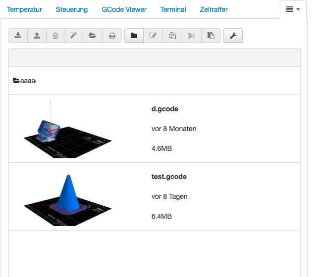
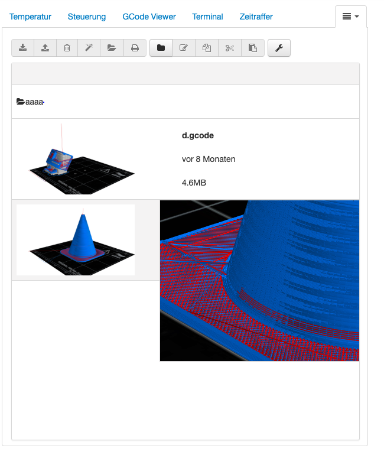

# OctoPrint-GBrowser

forked from octoprint-filemanager (https://github.com/Salandora/OctoPrint-FileManager) to support preview images for gcode files

## still under development

## Setup

Install via the bundled [Plugin Manager](https://github.com/foosel/OctoPrint/wiki/Plugin:-Plugin-Manager)
or manually using this URL:

    https://github.com/shodushi/OctoPrint-GBrowser/archive/master.zip

## More info:
Place image/photo of your gcode model in same folder as the gcode file with the same name and file ending ".png"
e.g.:
	your gcode-file is named vase.gcode, put an image named vase.png as preview image into same directory.

Generating images with the same look as in screenshots section below can be done with https://github.com/shodushi/gcode2png

## Screenshots

# View of file listings

# Zoom on mouseover

